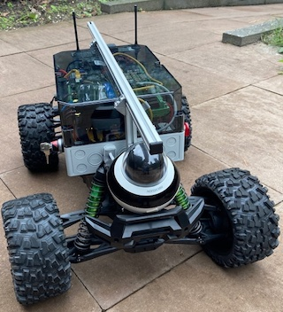

# Byodr - Build Your Own Delivery Robot 

Routine transport of small goods - packages, medicine, inspection equipment - can be done autonomously with simple routes. 
An unmanned vehicle is built to be smaller, cheaper and more energy efficient, because there is no driver on board. 
Such a vehicle requires teleoperation by an operator and self-driving software.  
This project comprises the set of software services that run this rover and others like it.  

> We went ahead and designed a rover that can be assembled from **generally available** components on the internet.  

## Links
* Website - [www.mwlc.global](http://www.mwlc.global)
* Documentation - [read the docs](https://byodr.readthedocs.io)
* Youtube - [More Work Less Carbon](https://www.youtube.com/channel/UCcR4AaPJflGaWlBFhHefzpQ)

## Features
* Browser based teleoperation via internet
* Community driven self-driving models
* Dockerized
* Free for personal use

