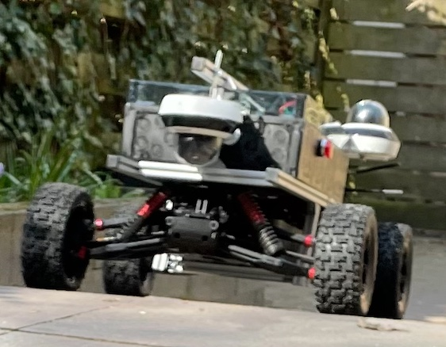
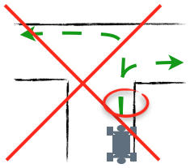
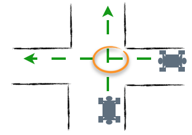
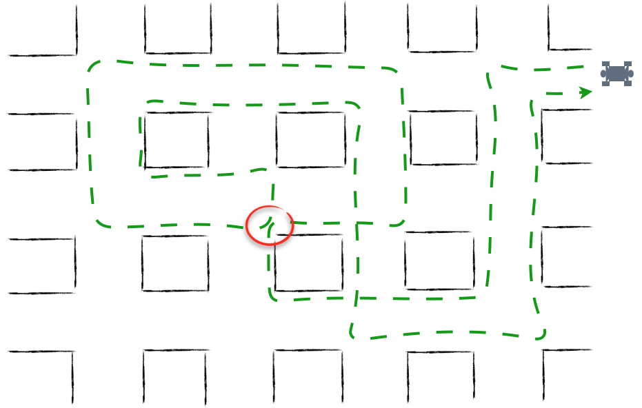
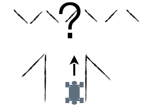
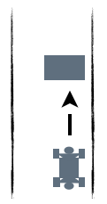

# Manual Training of the Autopilot

## Summary

The robot has an option to drive autonomously, the autopilot. Only in few situations will the autopilot be able to drive your route 
without any extra training. To have the robot drive your route there is an option to train the robot.  

To teach the robot to complete a route autonomously go through the following steps:  
* Decide upon a route
* Send route information to MWLC    
    - For an inside environment: a map or drawing
 
    - For an outside environment: a map or satellite image
* Ensure that the robot is accompanied by a person who has received instructions
* Complete the route 5-10 times in autopilot mode while training - do this clockwise and counter clockwise
* Send start and end times of your training sessions to MWLC
* Wait for the model update to complete - this may take several days to weeks
* Repeat the training steps until satisfied

### Stop

Press the red button on the outside of the casing.  

> On the port side of the robot there is a red button that stops the engine when pressed.

---

## Introduction

The main function of our robot is routine transport of small goods, such as packages or inspection equipment, using simple routes.  
As there is no driver on board the vehicle, it can be smaller, cheaper and will consume less energy. 
Without a driver on board there is a need for remote supervision by an operator or traffic controller.   

The robot has three modes to give an operator and/or traffic controller supervision over the vehicle and to save time:  
1. Teleoperation 
1. An autopilot with remote supervision, that can drive simple routes.
1. An option to train the autopilot to drive more complex routes.  

The teleoperation mode is explained in manual [controller and browser](operator_manual.md).  
To work with the autopilot it is useful to have some background information about its characteristics and the training procedure.

## Autopilot general behaviour 

### Virtual tracks within a corridor

By training the autopilot the model will learn to project virtual tracks (blue) on the route. 
The collection of tracks creates a corridor (orange) on the route. Within the corridor the robot 
knows where to go. The software will try to keep the robot on the average of all tracks in the corridor, the preferred 
path (green). The corridor is defined by the envelope of virtual tracks.  

As long as the autopilot recognises a corridor it will follow the preferred path. As soon it does not recognise this anymore, 
the robot will stop. Recognition of the corridor by the robot can be also be lost if circumstances change. Think of different 
light conditions, other furniture, extra cars, leaves, etc. all can cause a lack of recognition.  
Lack of recognition can be solved by additional training of the robot.

### Free passage

The robot will recognise if it has free passage on the corridor. This may not work 100% reliably, for instance when a person 
jumps in front of the robot to see if it will stop. If you are using the robot in autopilot take care that no unauthorised persons 
are near. The robot should be accompanied by a person who has been instructed and who can stop the robot by pressing the red button 
or by moving it by force.

### Avoid ambiguities

Any route can be trained as long as there is no situation that creates an ambiguity for the robot. The robot will drive as it has 
learned. When it encounters an ambiguity the robot cannot decide what to do.  
This means that the position and orientation of the robot cannot be the same for two different preferred paths.

#### Example A

The robot can be taught to go left at a certain point.  
Or (exclusive) the robot can be taught to go right at that same point.

However when completing a route it cannot learn to go right at one moment and left at another moment.  

#### Example B

The robot can be taught to cross another route. On the marked spot the position of the vehicle is the same but the orientation 
is different.  

This means that routes can merge. Before merging the orientation is different.  

#### Example C

The robot can learn to complete complex routes as long as position and orientation of the robot are not the same for different preferred 
paths.  

In this situation there is no difference in position and orientation for the short section of the route that is marked. 
Depending on the width of the corridors and how the relevant right and left turns are executed, this situation is likely to be 
ambiguous for the robot.   

#### Stopping

Besides stopping in the case of ambiguities the robot will stop if it does not recognise the situation.  

The robot will stop if there is no free passage.

### Your own route using autopilot

Training a new route is done in steps. For a simple route it wil take less than a day collecting data. 
More complex routes will take more time.  
To train a route follow these steps:  
* Define a route
* Collect data by driving and thereby showing how to complete the route
* MWLC will train the model  

As long as you are not satisfied with the route you can improve it by collecting additional data.

#### Define the route
MWLC will check the route to see if it fits in the model builder.  
Even after checking this  it’s not always certain that the route will work.  

##### How to define a route.
* Make your first route a simple route.
* Start and finish at the same point.
* An outside route is more simple than an inside route.
* The model needs visual clues. Visual differences along the route make it easier to learn.
* No features at all - e.g. empty space - makes it impossible to learn.
* A route along a long path is easier to learn than a short route with many non-typical turns.
* Make sure the route can be driven in clockwise and counter clockwise directions.
* Avoid ambiguities.

##### Map
Make a map of the route:  
* For an inside environment: a map or drawing
* For an outside environment: a map or satellite image  
  
Collect information about the intensity of other traffic on the route as a function of time.  
Contact Cloud-management at MWLC with the information.

##### Feedback
Cloud-management will make an estimate of the amount of training runs required and at estimate which sections of the route require
more intensive training.

#### Collect data

To collect data, complete the route 5 to 10 times in autopilot mode, in clockwise and counter clockwise direction.
On a new route the autopilot may not recognise much as indicated by the red steering wheel in the display. 
In this case the operator should override the autopilot and drive the robot while remaining in autopilot mode. 
When continuing like this the data will be collected and stored.  
Steps:  
1. Check the last update of the [Controller and Browser](operator_manual.md) manual.
1. Have an instructed person accompany the robot, out of sight of the forward facing camera.
1. Ensure that this person knows how to stop the robot.
1. Place the robot at the start of the route. This can be done with teleoperation.
1. Make a note of the start time of the training.
1. Set the robot to autopilot mode.
1. The operator has to drive the robot as long as the steering wheel is shown in red.
1. Start driving your robot.
1. Drive the route 5 to 10 times clockwise and 5 to 10 times counter clockwise.
1. Make a note of the end time of the training and leave the robot switched on.
1. Inform Cloud-management that you have collected data and during which time slots.
  

> Cloud-management will analyse the data to see if and how it can be used.

#### Model-update

To use data in a model the data has to be reviewed and annotated.  
This will be done by Cloud-management.  
Useful data will be added to the database with annotation.  
If all data is reviewed a model update will be carried out.  
After some time the model in the robot will be automatically updated.  
If necessary the need for additional data collection will be highlighted or further usage instructions will be provided.
  
> Please note: leave the robot switched on during updates and also while charging.  

#### Repeated data collection
After the first model update you can check if the autopilot has a better understanding of the route.  
Just repeat the steps of paragraph ‘Collect data’. We expect the steering wheel in the browser to turn blue more often than 
before the first and previous data collection runs, af successful model updates.  
It might be useful to collect extra data for difficult parts and expand your corridor (see corresponding section below).  

##### Complex situations
To train a complex situation have the autopilot drive the route.  
1. If the steering wheel is red, the operator has to override the autopilot.
1. The operator should drive the robot until the steering wheel is blue again.
1.  When de steering wheel is blue, take the robot off autopilot and drive the robot back to just before the point where the 
    steering wheel became red.
1. Put the robot in autopilot and have it drive until the steer turns red again.
1. Repeat the steps 1 to 4 several times in different conditions.

##### Expand corridor
The corridor is defined by data from the accepted routes driven in training. To broaden the corridor the operator can steer 
the robot a bit further away from the preferred path.  

##### Outside corridor correction
It is possible to train the robot to go back to the center of the corridor. Take the robot, without autopilot on, just outside 
the corridor. Put the robot in autopilot mode and steer it back to the preferred path.  

#### Using the model
Never leave the robot unattended.
