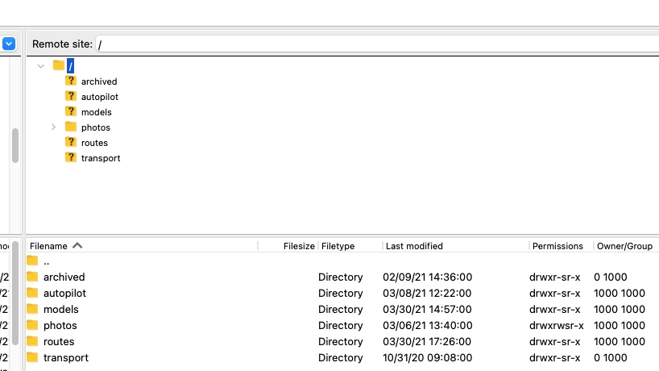
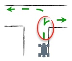
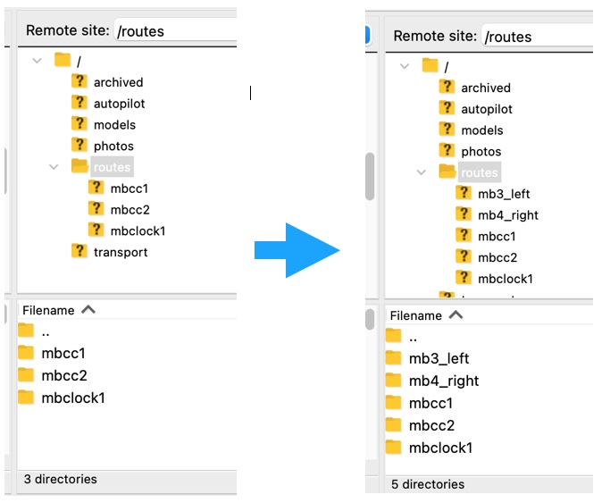
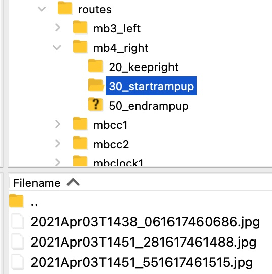
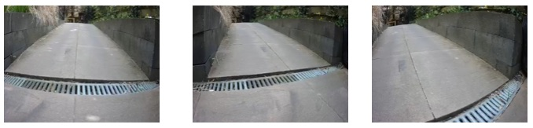
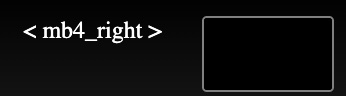
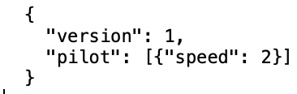
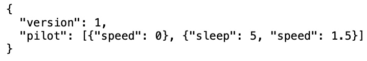

# Training the Autopilot
## Introduction
The main function of the robot is driving routes on a routine base, carrying small goods, such as packages or inspection equipment.  
As there is no driver on board, the vehicle can be smaller, cheaper and will consume less energy. 
Without a driver on board there is a need for remote supervision by an operator or traffic controller.   

The robot has two modes to give an operator and/or traffic controller supervision over the vehicle and to save time:  
1. Teleoperation; for remote control of the robot. The teleoperation mode is explained in manual [Controller and Browser](operator_manual.md).  
2. The autopilot; to train the robot and have the robot driving autonomously. To have the robot drive autonomous, the autopilot has to be trained.  

  

## Autopilot general behaviour 
### Virtual tracks within a corridor
  
By training the autopilot the model will learn to project virtual tracks (blue) on the route. 
The collection of tracks creates a corridor (orange) on the route. Within the corridor the robot 
knows where to go. The software will try to keep the robot on the average of all tracks in the corridor, the preferred 
path (green). The corridor is defined by the envelope of virtual tracks.  

If the autopilot recognises a corridor it will try to follow the preferred path. As soon it does not recognise this anymore, 
the robot will stop. Recognition of the corridor by the robot can be also be lost if circumstances change. Think of different 
light conditions, shades, other furniture, extra cars, leaves, etc. all can cause a lack of recognition.  
Lack of recognition can be solved by additional training of the robot.
### Free passage
The robot will recognise if it has free passage on the corridor. This may not work 100% reliably, for instance when a person 
jumps in front of the robot to see if it will stop. If you are using the robot in autopilot take care that no unauthorised persons 
are near. The robot should be accompanied by a steward who can stop the robot by pressing the red button 
or by moving it by force.
### No ambiguities, no navigation instructions
Any route can be trained without navigation instructions, as long as there is no situation that creates an ambiguity for the robot. The robot will drive as it 'as 
learned'.  
When it encounters an ambiguity the robot cannot decide what to do.  
This means that if the robot drives 'as learned' the position and orientation of the robot cannot be the same for two different preferred paths.
#### Example A
The robot can be taught to go left at a certain point.  
Or (exclusive) the robot can be taught to go right at that same point.

However when completing a route it cannot learn to go right at one moment and left at another moment.  

#### Example B
The robot can be taught to cross another route. On the marked spot the position of the vehicle is the same but the orientation 
is different.  
  
This means that routes can merge. Before merging the orientation is different.  

#### Example C
The robot can learn to complete complex routes as long as position and orientation of the robot are not the same for different preferred 
paths.  

In this situation there is no difference in position and orientation for the short section of the route that is marked. 
Depending on the width of the corridors and how the relevant right and left turns are executed, this situation is likely to be 
ambiguous for the robot.   

#### Stopping
Besides stopping in the case of ambiguities the robot will stop if it does not recognise the situation.  
  
  
The robot will stop if there is no free passage.  

## Your own route using autopilot
Training a new route is done in steps. For a simple route it wil take less than a day collecting data. 
More complex routes will take more time.  
To train a route follow these steps:  
1. Define the route  
2. Send route information to MWLC    
3. Have the operator driving the route in the tele-operation mode to assure he or she can drive the route smoothly. The autopilot learns to drive the route in the same way as the operator. The autopilot can never do it better as de operator.  
4. Ensure that the robot is accompanied by a person who has received safety instructions, the steward.  
5. Complete the route 5-10 times in autopilot mode in both directions.  
6. Send start and end times of your training sessions to MWLC.  
7. Delete the data which shouldn't be used for the training with a ftp-client.  
8. Wait for the model update to complete - this may take several days to weeks  
9. Repeat the training steps 4-8, until satisfied  
As long as you are not satisfied with the route you can improve it by collecting additional data.
To handle ambiguities you need extra pictures and file-management on the robot. This wil be explained under 'Ambiguities and halts'
#### Define the route
* Make your first route a simple route.
* Start and finish at the same point.
* An outside route is more simple than an inside route.
* The model needs visual clues. Visual differences along the route make it easier to learn.
* No features at all - e.g. empty space - makes it impossible to learn.
* A route along a long path is easier to learn than a short route with many non-typical turns.
* Make sure the route can be driven in clockwise and counter clockwise directions.
* Avoid ambiguities.
#### Inform MWLC cloud-management
Make a map of the route:  
* For an inside environment: a map or drawing  
* For an outside environment: a map or satellite image  
Collect information about the intensity of other traffic on the route as a function of time.  
Contact Cloud-management at MWLC with the information.
Cloud-management will make an estimate of the amount of training runs required and at estimate which sections of the route require
more intensive training.
#### Learn the operator to drive smoothly
All interventions in the autopilot mode, done by the operator are seen as data for training and will be integrated in de model.  
To avoid unwanted behaviour of the robot the operator should be able to drive the route smooth, without aan unnecessary turns of breaks.
Before training the robot, the operator should drive the route completely to see if unwanted manoeuvres has to be made.
#### Collect data
#####First training
Steps:  
- Check the last update of the [Controller and Browser](operator_manual.md) manual.
- Have a steward accompany the robot, out of sight of the forward facing camera.  
- Place the robot at the start of the route. This can be done with teleoperation.  
- Make a note of the start time of the training.  
- Set the robot to autopilot mode.  
- In the first trainingssession set the max speed zero, to avoid unplanned accelerations.  
  
- Start driving your robot.  
- Drive slowly to collect more visuals. Per meter between 20 and 200 visuals, under different circumstances, are necessary.  
- While driving, the steering wheel may swap between red and blue. Blue means that the autopilot recognise a corridor and free passage. Ignore this during the first training.  
- Drive the route 5 to 10 times clockwise and 5 to 10 times counter clockwise.  
- If finished, make a note of the end time of the training and leave the robot switched on.  
- Inform Cloud-management that you have collected data and during which time windows.  
- Cloud-management will analyse the data to see if and how it can be used.
#####Additional training
The autopilot needs several training sessions. Especially in complex situations or if the circumstances have been changed.
And, outside the circumstances will chances. Clouds, rain, sun from the east, sun from de west, etc.  
After the first model update you can check if the autopilot has a better understanding of the route.  
We expect the steering wheel in the browser to turn blue more often than 
before the first and previous data collection runs.  
For additional trainings you only have to train the parts of the route where de robot doesn't do well.  
Sometimes the hole route as to be trained just like the first training. Most of the time it are interventions on the route the autopilot chooses.
Differences for training with interventions:  
- Set the max speed of the autopilot on the desired speed.  
- As long as the steering wheel is blue and robot drives as the operator want it, no intervention is necessary.  
- If the steering wheel is red or the direction isn't right, the operator has to override the autopilot.  
- If the speed is according to the requirements, but the direction isn't, use the steering option for the right direction  
- If the direction is according to the requirements, but the speed isn't, use the acceleration or break options for the right speed and use the steering option to keep de robot in the right direction. If the speed is overruled the direction should be done manually.  

Advise:  
Don't make the intervention to short. If you do an intervention do this at least until the end of the turn. (keep as minimum 10 seconds.)  
The corridor is defined by data from the accepted routes driven in training. To broaden the corridor the operator can steer 
the robot a bit further away from the preferred path.  
It is possible to train the robot to go back to the center of the corridor. Take the robot, without autopilot on, just outside 
the corridor. Put the robot in autopilot mode and steer it back to the preferred path.  

####Delete unwanted trainingdata
If the operator is not satisfied with, parts of, the training, it's possible to delete this from the storage.
For deleting training data you can use a ftp-client. In this explanation [Filezilla](https://filezilla-project.org) for MacOS is used.
#####Filezilla
- Download and install Filezilla
- Under Filezilla/settings..., set Transfer Mode to Active under optoin Connection/FTP   
- Set Host: to ipno of the robot in ZeroTier.  
- Set Username: to  the ftp-login-id as mentioned in your credentials document.  
- Set Password: to  the ftp-login-password as mentioned in your credentials document.  
- Connect  
Under Remote site the folder structure of the robot will appear.
#####Structure of the data on the robot
 
autopilot - userdata, training and intervention sessions in zip format.  
models - systemdata, the ai-models downloaded by the robot from the MWLC-cloud.  
photos - userdata, pictures taken by the operator by pressing the left button n the controller.  
routes - userdata, routes managed by the operator  
To manage the training and intervention data only the autopilot data are relevant. 
Photos and routes will be explained under ambiguities and halts.  
Don't change anything in the systemdata.  
#####Delete training-data from the storage on the robot
Go in the folder autopilot to the folder of the month, via the year-folder, you want to manage the data. 
In the folder the zip files are named by the day and time of the moment of the first image in the folder.  
If you want to see what's in the zipfile, don't hesitate to download it to you own computer.  
Delete the unwanted training-sessions.  
Modifications in the training data are synchronised with the MWLC-cloud until 3 months after the are collected.
####Model-update
To use data in a model the data has to be reviewed and annotated.  
This will be done by Cloud-management.  
Data will be added to the database with annotation.  
If all data is reviewed a model update will be carried out.  
After some time the model in the robot will be automatically updated.  
If necessary the need for additional data collection will be highlighted or further usage instructions will be provided.  
The procces of colleting datafrom the robot, reviewing, upgrading the models and dowloading the model back to the robot will take 5 days to 2 weeks.  
  
> Please note: leave the robot switched on during updates and also while charging.  

## Ambiguities, halts and commands
The robot can be asked to recognise a location as a navigationpoint. This can be done by putting some images of that location in a folder on the robot.  
On that location the robot can be told to execute a predefined json-command of drive in a certain the direction.
The first option is used to have the robot stopping for sometime, increase or decrease the power to the engine.   
With the second option ambiguities can be solved.  
  
  

  
An ambiguity is a location in one or more routes where the robot, having the same orientation has more preferred paths. To solve this ambiguity, just ad some images of the direction where te robot has to go.  
Navigationpoints are part of a route.  
To use routes with navigationpoints and instruction you have to make, with a ftp-client:  
- in the folder 'routes' a folder with a recognisable name of a route.  
- in the route-folder a folder with a recognisable name of a navigationpoint  
- in the navigationpoint folder the images of the navigationpoint has to be placed.  
- if an instruction is desired put the json-command in the folder of the navigationpoint.  
- if more navigationpoints are use in a route, the should be sorted to the order of driving.  
  
The have the robot driving a route you can select it via the browser. Browse through the routes on the robot in the browser window at the top right, with the '<' and '>' buttons. The name of the active route appears between the buttons.  
To show this mechanism find an example hereunder.  
###Example route with navigationpoints
Behind our office there is our test track in the garden.  
Our duration test robot drove the track around 40thousand times.  
We want to complicate this by driving around an obstacle. Sometimes keeping it left, sometimes right.  
It should increase the max. power to the engine before the ramp-up and decrease after the ramp-up.
And the robot, Baxter, should sometimes stop just before the ramp-down to contemplate a few seconds about the meaning of live.  
We make two routes:  
mb3_left, keeping the obstacle at the left and stopping a moment before going the ramp-down.  
mb4_right, keeping the obstacle right and increasing speed at the ramp-up.
We wil use several navigation points and json-commands.
####Make routes in the datastorage on the robot
First, decide about the position and orientation where the robot has to recognise a navigationpoint.  
Take care that there are enough visual clues so the robot can recognise the location.  
Assure you have a ftp-client to connect with de datastorage on the robot.  
In the folder 'routes', make to new folders, 'mb3_left' and 'mb4_right'.  
  
   

In the new route-folder 'mb3_left' we make navigationpoint-folders:  
- '20_keepleft', with images of keeping the obstacle left.
- '30_startrampup', with images of where to increase power before the ramp-up.
- '50_endrampup', with images of where to decrease after the ramp-up.
- '80_stopbeforedown', with images of the place where to stop and drive ramp-down slowly.  
- '90_fasterafterdown', with images of the place where to speed up.  
  
In the new route-folder 'mb4_rigt' we make navigationpoint-folders:  
- '20_keepright', with images of keeping the obstacle left.
- '30_startrampup', with images of where to increase power before the ramp-up.
- '50_endrampup', with images of where to decrease after the ramp-up.

The algorithms expect the navigationpoints in order of driving. Therefore, we start the name of the navigationpoint-folder with a number related to the position in the route.  

####Make images and place them in the correct folder
Drive the robot to the navigationpoint.  
Make an image (Left button, see manual 'Controller and Browser').  
The image appears in the folder /photos/cam0/eeyymmmmm.  
Give a refresh if it's not there yet.  
To check if the image is correct, drag the image to your computer.  
If it's good, drag the image to the navigationpoint folder.
Make three images from slightly different angels and later also under different circumstances.  

  

  

Make images for al navigationpoints and drag them to the navigationpoint-folder.  
#####Test the navigationpoints  
If you want you can check if your navigation are working.  
Go to the browser window of the robot.  
In the top right you see the route selector en navigationpoint status:  
 

Click the '<' or '>' to select a route.  

By moving your cursor over the small image window you get te option to start:  

You can stop a route by moving your cursor over the small image window when a route is running:  

For caning a route you have to stop the old route, choose another en start the new route.

Start driving the robot in autopilot.

If the robot recognises a navigationpoint, this will appear in the little window.

  
####Add json-command
In the naviagationpoint-folder '/mb4_right/30_startrampup' we add a file with the name 'command.json' with content:  
  
This is just a single command.  

In the naviagationpoint-folder '/mb3_left/80_stopbeforedown' we add a file with the name 'command.json' with content:  
  
This is a more complex command. First reduce speed to zero, the wait 5 seconds and the set speed to 1,5. 

With these commands there is an increase of power before the ramp up and a decrease of power after the ramp-up.
For the ramp-down the opposite is done, first a stop and wait 5 seconds, then drive slowly to and off the ramp-down. After the ramp down the regular speed is set.

Test if you routes are working.

## Using the model
Never leave the robot unattended.