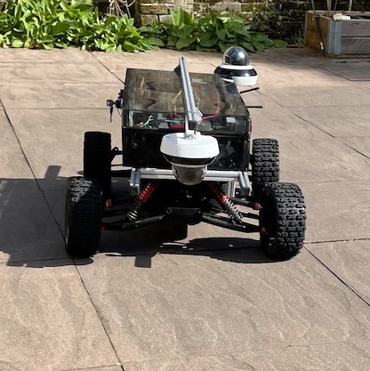

# Build Your Own Delivery Robot

Welcome, please feel free to browse or follow along the reading order as outlined below.

## Introduction

The main function of our robot is routine inspection and delivering small goods using simple routes.  
As there is no driver on board the vehicle it can be smaller, cheaper and consume less energy. 
Without a driver on board there is a need for remote supervision by an operator or traffic controller.   

The robot has two modes to give an operator and/or traffic controller supervision over the vehicle and to save time:  

1. Teleoperation - via internet on a browser  
1. An autopilot with remote supervision and to train the autopilot, to drive more complex routes    

> The robot is built with *publicly available parts exclusively* and can be assembled by anyone.

## Get Started
* Get a robot. Use the part list found under [Assemble kit](mwlc_kit.md), the [Assembly schemes](mwlc_as_schemes.md) and [Assembly documentation](mwlc_assembly.md) or place an [Order](mwlc_order.md) if you prefer pre-assembly.
* Setup the vpn. Have a look at our step-by-step [ZeroTierVPN guide](zerotier_manual.md). 
* Read about [startup and maintenance](startup_manual.md).
* Connect as your robot's operator via the [Controller and Browser](operator_manual.md). Learn to use the controller and take the first spin.
* Use and train the autoplilot of your robot with according [Training autopilot](autopilot_manual.md). 

> **Developer**? Check out the code on [github](https://github.com/cadenai/byodr).

## Disclaimer
*The robot as described in this document is a vehicle for testing software. Do not deploy the robot for applications that carry risk of 
any kind. Please pay attention to the guidelines and suggestions given, also for the use and charging of the battery. 
No explicit regulatory permission of any kind has been sought for deployment of the robot.  
The robot and the information in this document are subject to change. The document and the contents of the document are provided free 
of charge.  
This document and the robot have been put together with the greatest possible care. We are in no way responsible for any omissions 
and inaccuracies with regard to the information provided or the robot, for whatever reason. We do not accept any liability.  
The information and the robot provided are subject to certain intellectual property rights. Unless explicitly authorised to do so, 
you are not allowed to reproduce information provided for commercial purposes of any kind.*