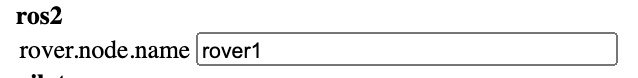

# Interfaces

## WAN
The robot several options to connect with internet.  
If a WAN connection over ethernet is available the robot will use it.  
Plug in the connection into the connector that is the most to the back.  
## Lan
To connect to the Lan on the robot plug in an ethernet-connection into the connector that is the most to the front. 

## Ros2  
The robot has a simple ros2 api.
There is a limited set of ros-commands that the robot can handle:  
  - Switch to autopilot  
  - Switch to teleoperation  
  - Set speed
###Node
The node name of the robot is default: rover1  
You can change this in the settings-screen at the robot.(don't change the other settings)    
  
  

###Ros-commands  
To switch to autopilot mode issue the following command:  
ros2 topic pub --once /rover1/v10/pilot/set_mode actionlib_msgs/msg/GoalID "{id: 'autopilot'}"  
  
Set the speed using:  
ros2 topic pub --once /rover1/v10/pilot/set_maximum_speed std_msgs/msg/Float32 "{data: 2.0}"  
  
Switch to teleop with:  
ros2 topic pub --once /rover1/v10/pilot/set_mode actionlib_msgs/msg/GoalID "{id: 'teleoperation'}"
  
##Other options
For more options check the assembly schemes and assembly documentation.  
Check out the code on [github](https://github.com/cadenai/byodr).

