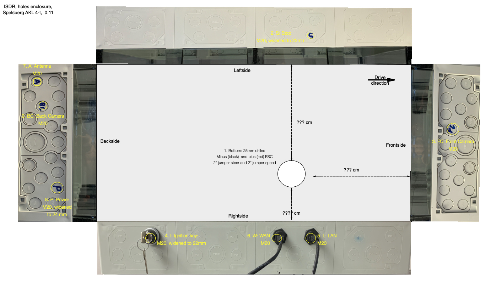
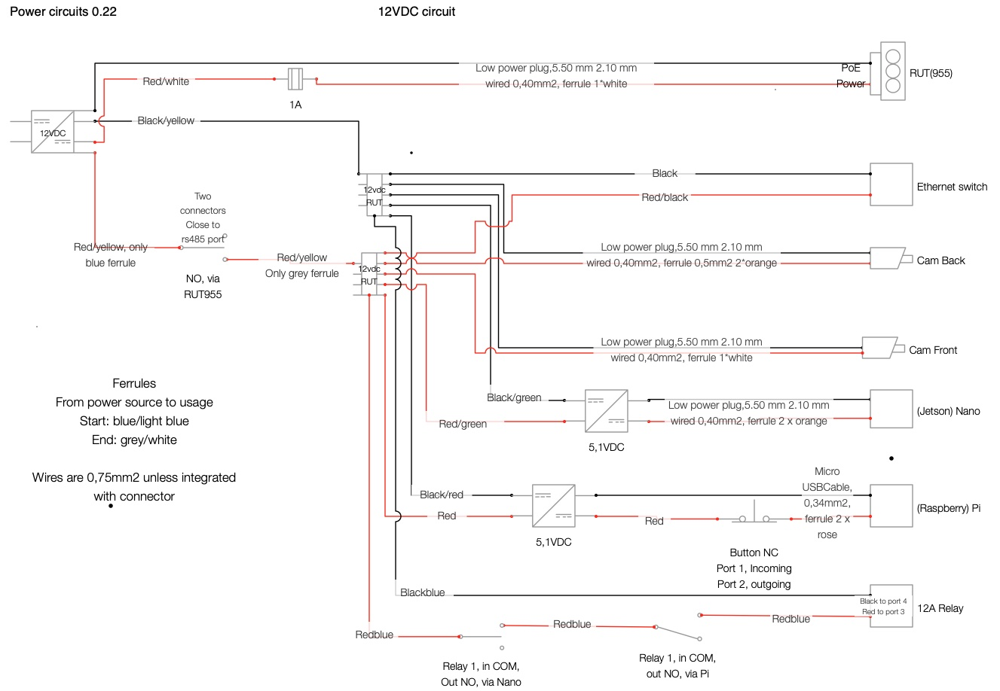
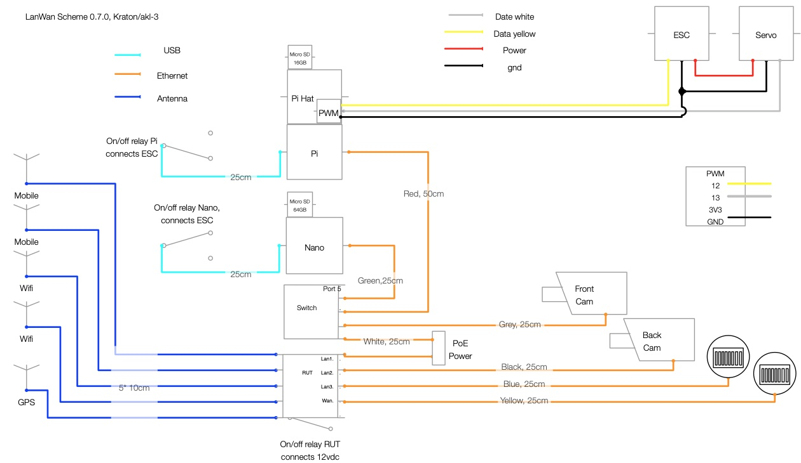

## Schemes
The documentation is made with care but might have mistakes.  
Always try to understand the logic.  
Documentation is never complete, things keep changing and there is no end to the details.  
Note: We are a software organisation. We build this robot on request of our users.  
They want robust, easy to maintain and not to expensive, robot built with materials that are available al over the world. 
We had the robot design checked by a third party but it's always at your own risk to use the robot.  
 
We use schemes as our basis. The other documentation is maintained after the schemes.  

###Scheme: 204000 Enclosure
Remark: This is not the latest version.  
The ethernet-connections are replaced to the most backward holes, just before the ignition key, on the rightside of the enclosure.
  

###Scheme: 206000 Power
##### Battery power
  
##### 12vdc power   

###Scheme: 208000 Communication

