# Introduction 
#### Disclaimer 
This documentation provides information intended to help people build a self driving robot and to use it. The development of the robot is ongoing and it is not complete. The information in the documentation is subject to change. The documentation is provided free of charge.The robot as described in the documentation is a vehicle for testing software. We do not deploy the robot for applications that carry risk of any kind. Please pay attention to the guidelines and suggestions given, also for the use and charging of the battery.  No explicit regulatory permission of any kind has been sought for deployment of the robot. This documentation has been put together with the greatest possible care. We are in no way responsible for any omissions and inaccuracies with regard to the information provided on the website, for whatever reason. We do not accept any liability.The information provided on the website is subject to certain intellectual property rights. Unless explicitly authorized to do so, you are not allowed to reproduce information provided on the website for commercial purposes of any kind.  
#### Instructions 
The instructions are exported from the development database and used by our technicians. The information might be a bit cryptic.  We are always open for improvements. Don't hesitate to [contact](http://www.mwlc.global/contact/) us, if you need some help or an extra picture. 
#### Content 
The robot is assembled in main stages: - Chassis - Body: External skeleton - Body: Enclosure - Cables, equipment - Configuration  
# Chassis 
#### Arrma Kraton 8S 
The  Kraton 8s is the largest Arrma model, but much too fast and with minimal carrying capacity. To be able to carry more payload, the vehicle must be converted so that the motors for steering and driving last longer. 
Before the chassis can work for the robot we have to change some parts. - Springs - Steering servo - Tires 
After unpacking take off: - Cover Green/Orange ARA409001/7 - 2* Battery holders ARA320496 - Back spoiler, ARA480022 - Spoiler mount, ARA320492 - ARA320485 - 4* Wheels including tires ARA510122/520055/550061 - Some small parts like bolts and nuts 
#### Springs 
Change the springs. To make the suspension more firm, first we change the springs to reduce pressure on the shocks. Put the large springs on the place of the originals and the small springs around the shock shaft. Find a video with instructions. Note: The front springs are shorter than the back springs(ARA330572 and ARA330573) 
#### Esc tuning 
Change ESC settings according to  Kraton 8S instruction manual. - Low voltage cutoff(variable 3) to Low(setting 1) - Brake strength(variable 5), 10%(setting 7) - Reverse strength(variable 6), 75%(setting 3) - Punch setting(variable 7), level 1(setting 1)Leave battery connected for next step 
#### Change steering servo 
This is a tricky operation, take some time to look for the video's, with instructions. - Place batteries in hand unit - Start the Kraton and the hand unit, set the steering wheels in straight forward - Mark position servo saver both on the saver and the casing with something sharp, like a screwdriver, so you know afterwards if it fits correctly. - Switch everything off - Release ESC/Servo unit, 4 screws bottom - Release cover, 6 small screws - Release receiver, and wires from the box. Take the antenna wire out of the little tube. - Release steering rod from servo saver to the steering connector on steering. Watch out not to loose little black lock nut m3, the bold will be replaced by a Allen screw, M3, 22 mm, quality 12.9. -Release plastic contra bolt in servo saver(hex4). Watch out, releasing is clockwise!!! - release bolt(hex2,5) far in servo saver to release is form the servo. Release safer with Allen screw driver. - Take the new servo, connect the wire to the servo first. - Take the new receiver box. Check if the new servo fits. - Swap the data cable on the receiver. Of the content of the package we don’t use the spring and the steering linkage. Change the servo, take care it is positioned exactly right. 
The steering rod bold should be replaced with an Allen screw M3x22mm, steel 12.9. 
After changing the servo you can remove the receiver 
#### Wire shortcuts 
__ Red wires of the on/off button__  Shortcut the red wires of the on/off button Use the orange ferrule double and the heat shrink. Heat shrink 2,5 mm 2:1 covering the ferrule metal tube. Heats chink 6 mm, 3:1, covering the ferrule. 
#### Cable gland bottom 
Before putting the enclosure on the robot, first put the cable gland around the cable from the ESC. - Take a M25 Cable gland with cable gland nut, lock nut and outer seal ring. - Put the gland nut over the cables for the ESC.(2 power cables and 2*2 thin data cables).  
- Take the multi seal or grommet, M25, 3 holes. Cut the holes open to put the cables through. - First put small cable through one hole then the orange and black from the ESC, each through their own hole. Then put cable gland around it. Screw the cable gland nut on the cable gland, not to tight. - Ensure that the shortest wire, the steering servo connector is reachable in the enclosure. The gland must be quite tide to the chassis. You can check this after making the bottom hole. 
# External skeleton 
The skeleton is built with the aluminum profile. 20 x 20 mm, groove 5. In the end it should look like the picture.  
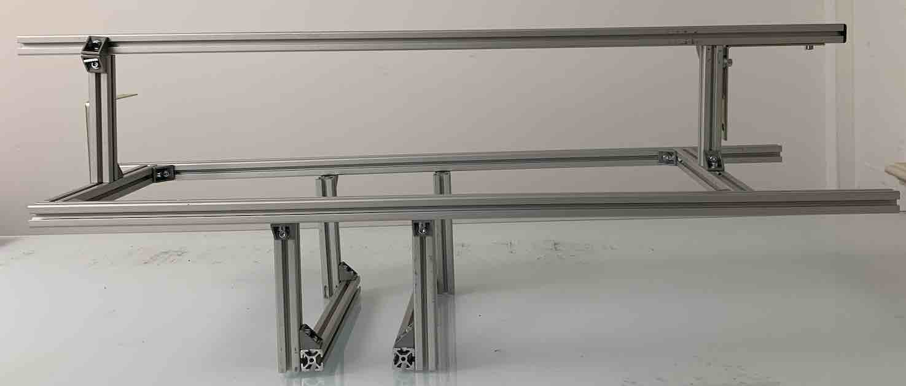 
We have two kinds, both for groove 5 but 1 kind for Allen screw M5 and 1 kind for Allen screw M4 that is used for the brackets. These options are also available in plate versions. The blocks easy to work with but more expensive. 
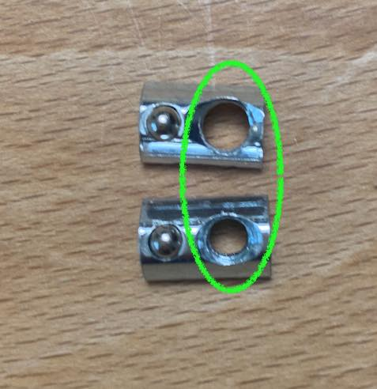 
#### Crossbeams 
Connect 2 crossbeams, 0,23m to the bottom of the chassis. Use the empty holes from the battery holders and the M4 screws. 
#### Pillars(vertical profiles) 
Attach 4 pillars, 0,14m with brackets on the low crossbeams. The bracket are under the chassis. 
#### Longitudinal beams 
On the pillars the longitudinal beams are fastened. At the right side 0,79m. At the left side 0,85m.(longer to connect the back camera) To protect the front camera, at the front, both beams will end in front of the front camera. At the back, the right beam stops 2 cm after the end of the enclosure. The left beam goes further to the 6 cm back, to mount the back camera. The longitudinal beams should be close to the bottom of the enclosure but don't push it up. The enclosure should rest on the towers of the chassis. 
#### Cross beams high 
On the longitudinal beams the high crossbeams  of 0,23m are attached. They are close to the enclosure to keep it in place 
#### Lock pillars 
At both the front and the back side, attached to the high crossbeams, there should be the lock pillars of 0,13m.  It might use full to connect the front lock pillar with to brackets as the fornt-side of is often used replace the robot. 
The lock longitudinal beam, 0,90m, wil be attached to the lock pillars. This beam is a bit longer to catch the hits. Connect the beam with 2 brackets at each side for easy opening.  
#### Mount front Camera 
Bracket 150*150mm with 3 holes per side Bracket 60*60mm with per side 2 holes 1* Allan screw M5   6mm 1* Allan screw M5 10mm Tripod screw 8mm 2 repairwasher m5 2 washer m5 2 Slide nut  
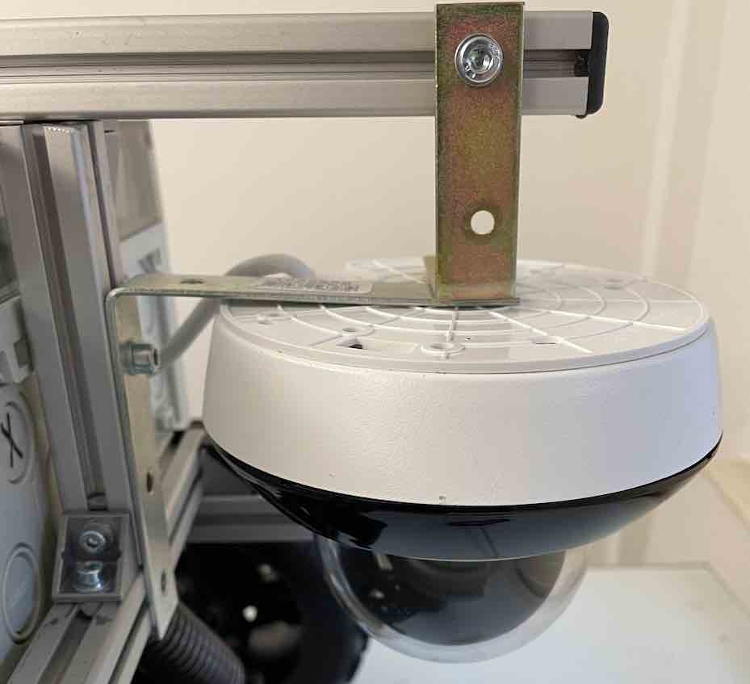 
Mount back Camera 
Bracket 150*150mm with 3 holes per side Tripod screw  1 * Allan screw M5 10 6 washer M5 Slide nut Extra bracket to lock camera 
# Enclosure 
In the end the enclosure will look more or less like in the picture. But we have to admit, every build we find an improvement. Less cables, less space used, more easy to open. In the instructions you find our latest build. The switch is below the Nano. Sometimes we get a request for a larger battery. This takes some space. 
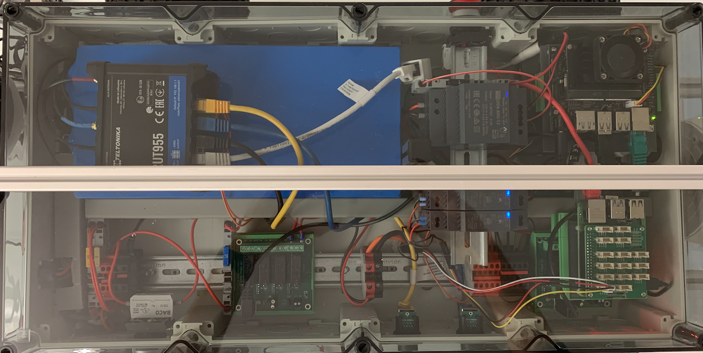 
__ Silica __  Don't forget to put in a pack of silica gel. But this can be done any time. 
#### Spelsberg AKL-4-t  
The Spelsberg enclosure AKL-4-t has transparant cover, metric pre-embossings. Slightly cheaper alternative enclosure has a non transparant cover. The enclosure should rest on the front and back towers of the chassis. As the center tower is just slightly lower and the bottom of the enclosure has ridges. To make the bottom of the enclosure resting on the towers only, make a cross at the top of the centre tower to fit the enclosure in. At the end we put some double sided adhesive tape at the towers. 
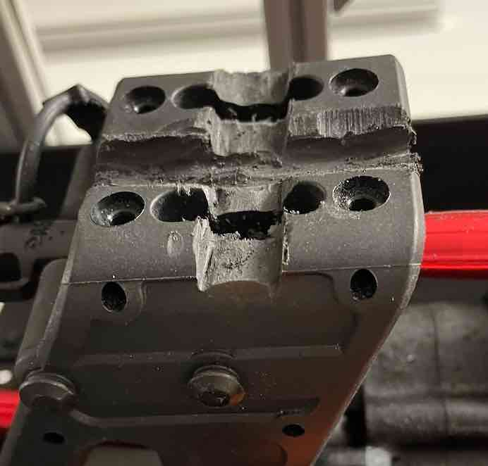 
#### Holes, glands, connectors and buttons 
See scheme voor the location and size of the holes. We use step drill bit to make or widening the holes. It might be a suggestion to keep the part that needs the hole, nearby to see if it fits. We always start with the bottom-hole and make is fit perfectly, even by putting the cables through the gland and see if the enclosure fits well.  
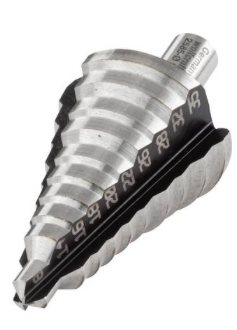 
__ Bottom hole __  One of the more tricky parts is the location of the bottom hole for the M25 cable gland with the ESC power and  datacables. The outside bottom of the enclosure has ridge wich should stay intact. Check with the already attached cable gland the location. 
__ Charge connector __ The screws to tighten the Rosenberger-connector need some space. Avoid that the hole gets more to the top of the enclosre. While widening we press the drill to the bottom of the enclosure.  
__ Antenna cables __  The 5 antenna cables should be at the back-side left. Bring the cables around 0,15m within the enclosure. - Put the cable gland nut over the cable connectors - Take the black single seal ring from the gland and put it also over the connectors. - Take the multi-seal with 5 holse, cut the holes en put the cables through. Put around the multi-seal the big single seal from the cable gland. First put the cable gland over the cables before putting is in het enclosure. Don't make the cable gland to tide yet.  
__ WAN __  The WAN connector should be right-side of the enlcore most at the back. The connector at the inside should point up with a small angle to the back.(The Lan connector will be above it)Use a self-adhesive cable mount, under the enclosure, to keep the cap to the vehicle wen not on the connector.  
__ LAN __ The Lan connector should be just above the WAN connector and a bit to the front.  
__ Cable gland back Camera __  Grommet qt 6, around camera cable between camera and first split. Not too close to split. It should be possible to have the cable bend within the enclosure. Take the two white parts ant put them around the grommet. The grommet fits just in one position exact right. Take the sealing ring over the cable and put it around the gland.<>Pucht the gland though the enclosure. Take the black splittable contra nut and tighten the gland to the enclosure. - Put the black 0,25m ethernet cable in the connector. - Put the 0,5m low voltage power cable in the connector.  
__ Cable gland front Camera __ Grommet around camera cable between camera and first split. Not to close to split. It should be possible to have the cable bend within the enclosure. Cabel gland front camera works the same as back.  
__ Ignition switch __ Ignition switch is mounted at the same side as the LAN and WAN, just a bit to the fornt of the LAN.  
__ Stop button __ Stop button is mounted at the opposite side, left, the front, of the enclosure. 
# Cables and equipment 
#### Battery and internal frame 
__ Backside cable duct __ Put a piece, 0,28m, of cable duct against the back. - Make it fit by taking the back side corners off. - Take teeth off by the cable cland of the antenna's. - Take teethparts off for the camera cable gland. - Take 3 teethparts off for the Rosenbergerconnector. Depending on the battery it might be handy to split the backside cable duct so it fits at both sides of the length cable duct.  
__Battery __ Put battery at back-left side in the enclosure, against the back side cable duct.  
__ Length cable duct __ Put a 0,58m cable duct in the middel over the full length of the enclosure against the right site of the battery. - Make the back 3 cm flat so you can put it under the back cable duct or have the backside cable duct at both sides.   
#### __Enclosure lay-out__ The battery is the largest component within the enclosure. As soon as the battery is in place, you can make a lay-out for the other components. Collect the main components that should be in the enclosure and  prepare the equiment holders for the Nano, Pi and the two USB-relays. Think about how to fasten the ethernet-switch. The best opption is not to need two layers and have all equipment on the bottom of the enclosure and on top of the battery. The battery should be fixated.  
#### Equipment holders 
__ Holder for the Nano steered Relay __  Use  Axxatronic 72mm: - 2 end parts - 1 narrow part - 1 widepart.  
__ Holder for the Pi steered Relay __  See Relay Nano steered holder.  
__ Nano holder __  First, place SD card. - Take PVC plate 107 x 100mm (or 72x80mm, if there is not a lot of space. - Take 4 allen screws, 2,5x10mm - Take 4 lock nuts 2,5mm - Take 4 spacers - Assemble Nano on the pvc plate, nuts topside,  cable connections on the nano to the left. - Put  the plate with Nano on axxatronic 107mm( or 72mm) with foot.  
__ Pi holder __  First, place SD card. Then mount the hat on the Pi with the mounting set that comes with the Pi- Take PVC plate 80 x 72mm - Assemble the hat on the Pi on the pvc plate, wiIth the spacers and screws from the set delivered with the hat. - Assemble the Pi on the pvc plate, wiIth allen screw 2,5x12. - Put  the plate with Pi on Axxatronic 72mm with foot.  
__Optional: internal frame __ You can use this if  you can't find enough space on the bottom of the enclosure. The internal frame consists of a few pieces of alluminium profile. A small pillar close to the battery. Connected to a horizontal piece to the front of the enclosure, that is conncted with a crossbeam to keep it stable. Make a fitting frame. 3 pieces of profile: - Pillar, from the bottom of the enclosure to the cover. - Longitudinal, from the baterry to the front side. - Crossbeam, at the front from left to right.  
__ Din rail __  Put 0,58m din rail over the length of the right side of the enclosure but not on the incoming ESC cables. Put it against the backside cable duct. Put din rail over the length of the left side of the enclosure. From the battery to the inner front side of the enclosure. Put it against the backside cable duct.  
For a second layer you have to improvise with the din rail. For instance: - ethernet switch to crossbeam profile of internal frame, 0,05m - Computers, 0,25m - 12vdc converter, 0,10m - 2*5vdc converter, 0,10m 
# Cabling 
Start with putting all component, losely, in place in the enclosure. After al cables and wires are connected, fixate the component. It might be usefull to have the schemes at hand. While doing we also connect the ethernet cables, so keeps this scheme also nearby.   
__Hints__ Step by step the cabling voor the power will be assembled. To avoid problems also some equipment and computer cables will be placed. Some basics: - Put cables and wires as much as possible in the cable ducts, without forcing of course. - Use ferrules and cables with the right colours. This will help you later on. - We connect the power per cicuit. I suppose there is more efficient methode but per circuit is simple. - The cable length is more complex as we thought. If there are lengths on the scheme, just ignore them. - I tailor the length on the moment I put it in. Take a wire in the right colour, put a ferrule on it. Connect 1 side. Lay it via the cable duct to the other end. Then cut it to the right length and put a ferrule on it. - Not all wire have a ferrule at both sides. For instance in the fuse-holders and the RUT955 green terminal. - Worst mistake is not tighten a wire enough to a connector. This is hard to test. - The schemes with remarks are leading. - Our working order is described.  
__ Back camera __ Fold the ethernet cable and power cable in the cable duct. Plug in power wires in accoring to scheme, lay them in de cable duct direction RUT-distribution. Connect the Ethernet with the router with a ethernet cable according to scheme. Fold them in cable duct.  
__ WAN __ Put ethernet cable in.  
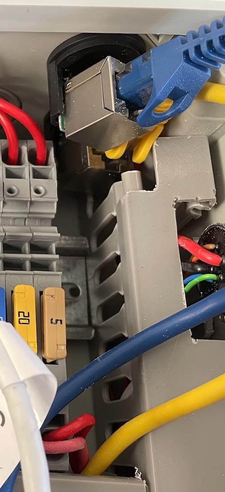 
__ LAN __ Put ethernet cable in.  
__Ignition switch__  Put the adaptor plate horizontal on the inginition switch. Put the NO-contact breaker on the lower position of the adaptor plate  
__ Stopbutton __  Put the adaptor plate on the stop button. Put the NC-contact breaker on the adaptor plate The positon can be choosen as suits you the best. 
__Battery and charge__Place 4 fuseholders on the din rail, between the ethernet passthrough's and the adaptar plate from the ignition switch. Place 2 red terminal blocks on the din rail(option to disconnect on inside). Place 2 black terminal blocks on the din rail(option to disconnect on inside). Option: if the battery cable is more the 4mm2, take thick terminal block. Option: if the battery has seperate cable for plus(red)-pole, take extra red terminal block. Option: if the battery has seperate cable for minus(black)-pole, take extra black terminal block. Put a shield against the open side of the last terminal block. - Red wire from battery in the first fuse holder. - Red wire from first fuseholder to first red terminal block. - Red wire from charge connector into second fuse holder. - Red wire from second fuseholder to second red terminal block. - Option: If there is seperate extra red charge wire on the battery, connect this to the extra terminal block and lay the red wire from the second fuse not to the red terminal block but also to the extra red teminal block.  - Black wire from battery into (thick) black terminal block - Black wire from charge connector into black terminal block - Option: If there is seperate extra black charge wire on the battery put both the charging wire as the wire from the charger into the extra black terminal block. 
Create main distribution: - Connect the black terminal blocks with bridge. - Connect the red terminal blocks with bridge. This thus not include the optional charge terminal blocks. 
__ Terminal blocks ESC input __ Put the terminals in back from the cable-gland and connect the power.  
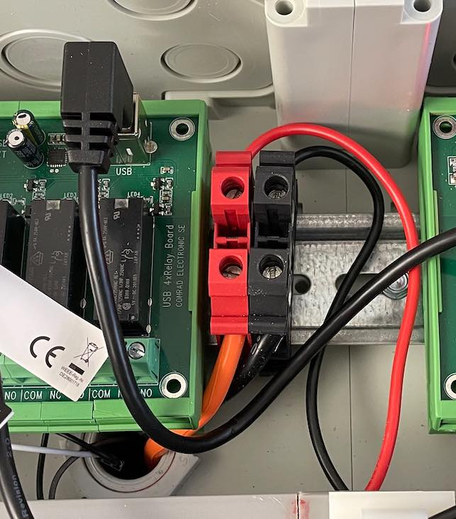 
__ SSR(Steady State Relay__ Put the SSR losely on the din rail in the second part of the enclosure. Connect the power according to scheme, via the third fuse. After connecting the  control wires in port 1 and 2, the SSR can be fixated.  
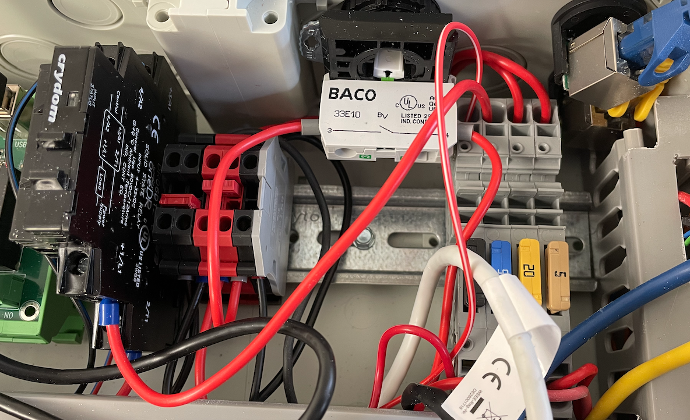 
#### __ Power cabling to 12VDC__Put the 12vdc losely in place. The 12vdc power start with the ignition key. After the ignition al other system will be started. Connect according to scheme with the battery power. The incoming power should be place against the wall of the enclosure.  
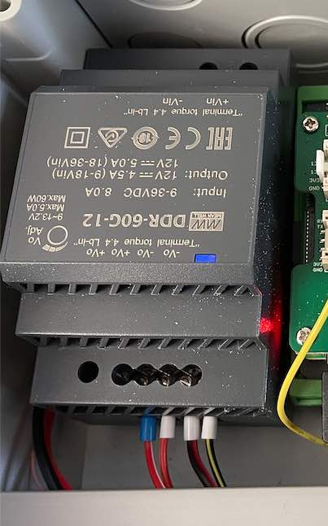 
__ Rut955 PoE __ Connect power from the first set of 12vdc-converter with the PoE-injector for the RUT955 via the fourth fuse.  
__ Place RUT-distrbution __ Put beside the ESC connector: - 6 red thin terminal blocks - Connect them with a 5 bridge and a 2 bridge - 6 black thin terminal blocks - Connect them with a 5 bridge and a 2 bridge Put them losely. Plug in the incoming wires from the power source in the back side. Then you can fixate them. Put wires to the end-power consumer on the fornt.  
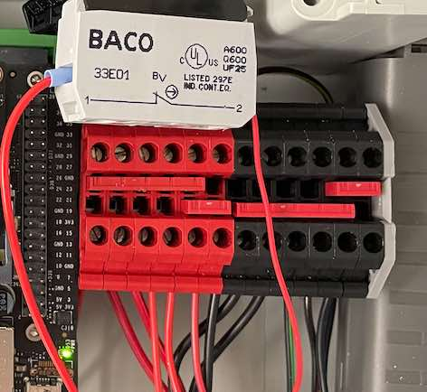 
__ Connect RUT-distribution __  See scheme. This goes via the relay on the RUT955.  
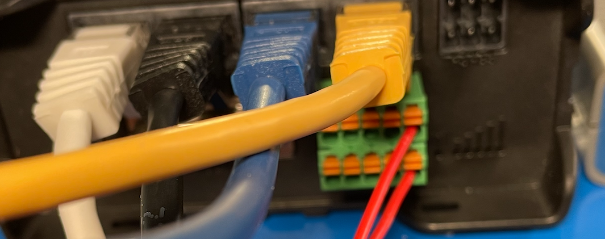 
__ Ethernet switch __ Connet the power of the ethernet switch.  
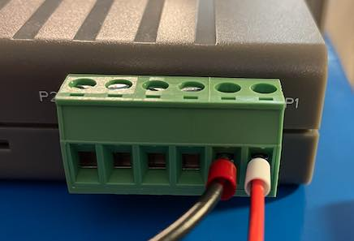 
__ Front camera __ Plug in power wires in according to scheme 
__ Back camera __ Plug in power wires in according to scheme 
__ Power Nano__ Plug in power wires in according to scheme, via a 5vdc converter  
__ Power Nano __ Plug in power wires in according to scheme 
__ Power Pi __ Plug in power wires in according to scheme via the 5vdc-conveter and the stop-button.  
__Remaing SSR control wires__Make the remaing connetions of the control for the SSR with the RUT-distribution.  
__ Power Nano __ Plug in power wires in according to scheme 
__ Grove Pi to steering and ESC __ Plug in power wires in according to scheme 
__ Ethernet Pi Nano front camera __ Plug in power wires in according to scheme 
# Testing 
When starting upo the following light and sound should apperar: - Blue 12vdc - Orange RUT Wait - 5vdc - Camera check - Lights ethernet - Lights Nano - Light Nano steered relay - Lights Pi 
Close the encloser and use the locker profile to fixate the encloser on the chassis.  
# Questions and suggestion 
The assembly instructions are user driven and created based on questions to give guidance on certain aspects. If you have any question, don't hesitate to contact us at [www.mwlc.global/contact/](http://www.mwlc.global/contact/). 
