# Controller and Browser

## Quick start

### Stop the robot by the steward

Press the red button on the outside of the casing.  

On the left-side of the robot there is a red button that stops the engine when pressed.  
The steward should stay left of the robot in reach distance of the button.

### Certificate
If you need a certificate: Download the certificate from web-server of the robot and set it to trusted on your computer.  
Some more information is found under the paragraph: Get the certificate  

### The Robot
Turn the key to the vertical position with the white indicator pointing upwards.  
Wait a few minutes until the robot's internal lights are on and you can hear the sound of fans.

### Browser
On your computer open chrome and type in the robot's [ZeroTier managed IP](zerotier_manual.md) in the browser address bar.  

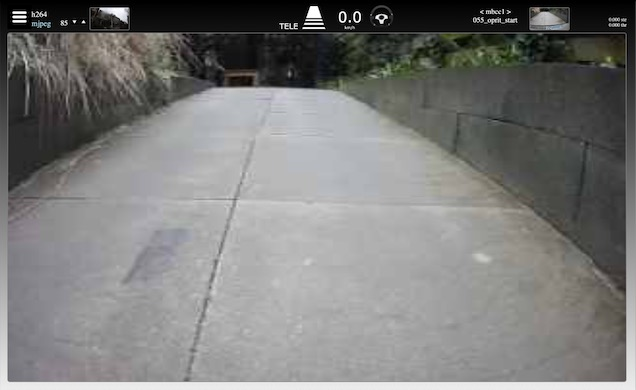

On connection success the browser window should look like this (with a different view).  
In the top section of the screen you can see status information.

### Stop the robot by the operator

Press the `east` button twice to stop the robot.

`east` is the rightmost button, red or with a red circle
### Controller in Teleoperation
Please use the triggers carefully, the robot may be more powerful than you expect.  
- Go to teleoperation and start engine: Press the `east` button.  
- Drive forward: Press carefully the `left trigger`.  
- Steering: The `right joystick`.  
- Go to reverse: press the `right trigger` totally down and release it.  
- Drive backwards: If in reverse, press carefully the `right trigger`.  
- Active engine braking in forward-mode: The `right trigger`.

> The engine is turned off after a few minutes of inactivity, press `east` to turn it back on.  

### Controller in Autopilot
* Activate the autopilot: Press `north`  
* Drive: After starting the autopilot the max speed is always zero, which also means the the robot doesn't move. To have the robot drive the maximum speed should be above zero.  
Press `up arrow` to increase the maximum speed and have the robot driving.  
* Press `down arrow` to reduce the maximum speed or come to a stop

---

## Controller
### Supported controllers
Chrome has been tested with recent xbox controllers, both wired and wireless, and recent wireless ps4 controllers.  
These type of controllers do more or less the same but use different button labels and graphics.

> Other browser/controller combinations may seem to work on first inspection - they get the 'standard' mapping in the html5 gamepad api -
> but be aware of unforeseen consequences due to ongoing developments in the api and browser stacks.

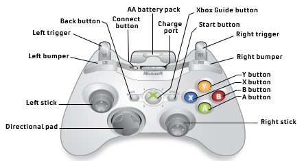
   
The controller has:
* Two joysticks on the top face: One on the left and one on the right
* Two groups of four buttons on the top face: In this manual we name them: `left-, right-, up-, and down-arrow`
  
  The buttons in the right group are named: `north, south, east and west`
* On the front of the controller there two buttons at each side. They are named `left button` and `right button`   
  The bottom triggers are called `left trigger` and `right trigger`

Control and acceleration values are sent from the controller via the computer to the robot.  
In addition the controller is used to send instructions to the autopilot.  
The controller has two modes, teleoperation and autopilot. 

### Stop
Press `east` twice:  
* if the controller or computer is in sleep mode; wake them up, go to teleoperation mode and stop
* if the robot's engine is in sleep mode, start it, don’t drive the robot
* if the robot is in autopilot mode; go to teleoperation mode and stop

> Warning: if connections are lost, the robot will not respond. If you have physical access to the robot, press the red button, use the key
> or simply move the robot aside by force.

## The Browser  
The browser has to support the controller and Java-script.  
Voor testing Google Chrome for MacOS is used.  
### Teleoperation
#### Warnings
If applicable in the top of the window a warning will appear. There are several warnings possible.  
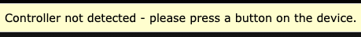  
Controller not detected. Try to press `east` to get it online.  
    
  
  
Another user in control. This can be more difficult to solve; there might be another user in control or perhaps another browser, window or tab on the same computer is connected.
  
  
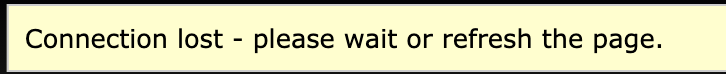

Connection lost. This can have many reasons; please refer to the manual [Connections and ZeroTier](zerotier_manual.md) which includes a section on problem solving.

#### Options

* Click the “hamburger” icon (leftmost) to:
  
    - Stop the data stream from the camera to your computer 
    - Go to the settings screen. To return to the main screen use the browser's ‘Back’ button.  
    - The settings itself are only used for development purposes. Check github for more information.
* h264: Stream from the camera based on system settings.
* mjpeg: Stream from the camera with manual compression control. Use the up- and down arrows to change the image quality in order to 
  minimize latency.

> These settings can be used for teleoperation and do not affect the autopilot.  
> In bad connection circumstances it can be necessary to manually set low image quality just to obtain acceptable latencies.

####Backcamera
Right of the options there is the small window with the view from the back-camera.  
Click on it to make a larger window visible above the large window of the front-camera.  
Click on it again to hide the large window.

####Feedback

  
Centered in the top of the window is the status about the mode and the speed.

  
Beside the speed you find the feedback of the position of the wheels via a steering wheel icon.
The steering wheel rotates on screen:    
* Indicating the current steering value from the controller
  
* When grey: The robot recognises its driving corridor but the robot reacts only on operator input as a result of teleoperation mode
* When red: The robot does not recognise its driving corridor  

> A grey steering wheel indicates the autopilot is ready to drive at the moment.

### Autopilot

#### Warnings and options
See section teleoperation

#### Input status

'AUTO': Autopilot mode
 '10': Autopilot is set at maximum speed 10 km/h.

#### Feedback status
The steering wheel rotates on screen indicating the current steering value from the autopilot.  
The speed value displayed is the maximum set value minus several autopilot estimates of the current driving situation  
  
When blue, the robot recognises its corridor and that is has free passage.  
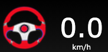  
When red there are several options:  
- The robot does not recognise its corridor.  
- The robot is in a position and orientation that fits in more corridors with out a direction from a route.(see also training autopilot)  
- There is not a free passage.  
- A combination.

## Camera handling
The camera has a pan and tilt function which can be operated using the controller.

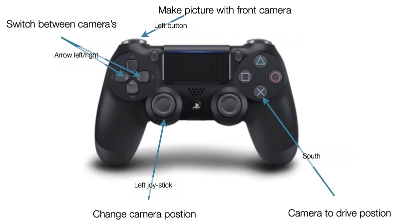

* `Left joystick`: Move to change the camera's pan and tilt positions
* `South`: Move the camera to its preset home position
* `Left arrow` and `Right arrow` : Switch between the camera's.(Show large window of back-camera via option in top)
* `Left button`: Make picture with front camera and store it in the month-folder in /photos/cam0.  
### Camera home setting
The cameras have a home setting. This can be changed.  
Warning: For the front-camera, the home setting should be the position that makes the AI-models work.  
> A slight mis-alignment may give unexpected behaviour of the robot.  

For changing the home setting:  
- choose the camera by pressing the the right or left arrow.  
- Set the camera in the new home-position with the left stick.  
- Save the new home position by pressing the X-button(blue) 10 seconds, then keep this button pressed and pres three times the A-button(green).  
- Test the new home positon by turning the camera with the left stick, press the A-button and see if the camera turn back to the new home-position. 

## Details on Teleoperation mode
Teleoperation has two sub modes:
* Forward
* Reverse  

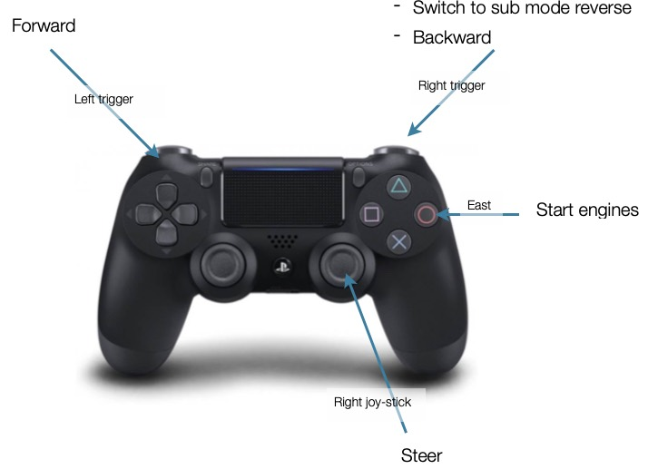

> There is no visual on screen indication of the sub mode.

### Button functions for driving
* `East`

    - if the engine it not running, start it.
    - if moving, stop. 
* `Left trigger`  
    - when pressed and stopped or moving forward, accelerate until maximum power.

    - when pressed and moving backwards, engine braking.

    - when released and moving forwards, roll to stop.
* `Right trigger`
    - When pressed and moving forwards, engine braking
    - When pressed and moving backwards, accelerate backwards until maximum power.

    - When pressed fully in sub-mode forwards and not moving, nothing happens but switching to sub mode reverse.

    - When pressed in sub-mode backwards and not moving, accelerate backwards until maximum power.
  
    - When released
and moving backwards, roll to a stop.
    - When released and moving forwards, roll to a stop.
* `Right joystick`

    - move left/right, turn wheels.

    - move up/down, not in use.  

## Details on Autopilot mode
The robot can only drive if it recognises one, and only one, corridor.
 
If the robot can recognise one corridor then a maximum speed above zero is necessary to drive.
 
The autopilot chooses its speed based on the speed during training in combination with certainty of recognition of the
corridor and it never exceeds the maximum set speed.

### Interventions

The autopilot can be overridden by commands from the operator: 
* Increase or decrease speed and steering.(If speed is overruled by the operator the autopilot releases the steering also.) 
* Just steering commands

> In autopilot mode it is not possible to drive backwards.

### Button Functions

#### Instructions

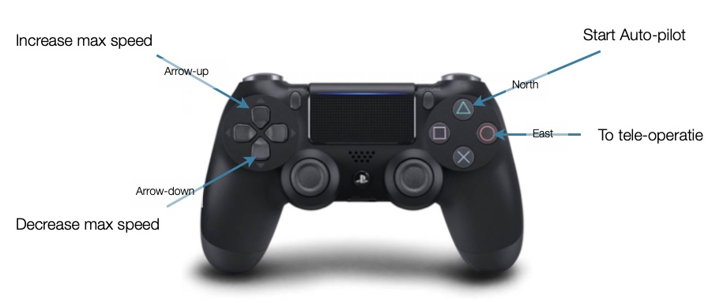

* `East`
    - wake up the controller and start the engine
    - switch to teleoperation mode

    - if the computer and/or controller are in standby, wake-up

    - in other situations, set the max speed to zero, go to teleoperation mode
* `North`. When in teleoperation, press to:
    - stop, set max speed to zero

    - switch autopilot on

    - show autopilot mode on screen

    - without instruction, the autopilot does what it was taught to do at that location 'As learned'
    - with instruction, show it on screen.
* `Arrow Up`. Press once briefly to:

    - increase the maximum speed by 0,2 km/h

    - show the max speed on screen   

    Press and hold:

    - the maximum speed increases by 0,2 km/h per 0,5 sec of pressing the button down

    - show the max speed on screen
* `Arrow Down`. Press once briefly to:
    - decrease the maximum speed by 0,2 km/h

    - Show the max speed on screen
   
    - Press and hold to

    - decrease the maximum speed by 0,2 km/h per 0,5 sec of pressing the button down 
    - show the max speed on screen

> Note that the autopilot currently supports the 'As learned' instruction and not the others.

#### Operator interventions overrule the autopilot 
Intervening in the instructions from the autopilot to the engines, without stopping, means also training the autopilot.  
To avoid unwanted actions from the robot, delete the trainingsdata from the storage on the computer.

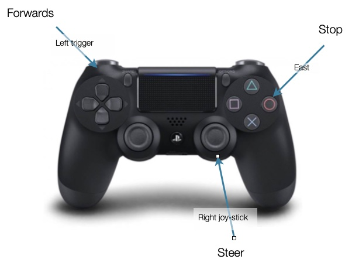

* `Left trigger` 
    - increase speed up to the set autopilot max speed  
    - override steering instructions from autopilo(operator should steer). 
    - record images, instructions and values including but not limited to steering and throttle, for training purposes   
    Release to:

    - leave the speed for the autopilot to determine
and stop recording
* `Right joystick`

    - steer
    - record images, instructions and values including but not limited to steering and throttle, for training purposes   
    - up/down movements are ignored  
* `East`
    - Stop

## Certificates
The W3C-community decide recently that Game-pads are only available within the secure-context(https).  
The implementation off this decision is not very strict. Some browsers ask a certificate, others not.
There are no official certificates for private IP-no as used within the ZeroTier VPN's.  
If your browser demand a certificate then tis is possible.  
MWLC made self-signed certificates available via the webserver on the robot.
To use the certificate you have:  
- Get the certificate  
- Install and trust it

###Get the certificate
Assure your Robot is available in the ZeroTier network.  
With Firefox, in the Mac-environment, the following steps are taken:  
Click the HTTPS-lock-icon before the URL.

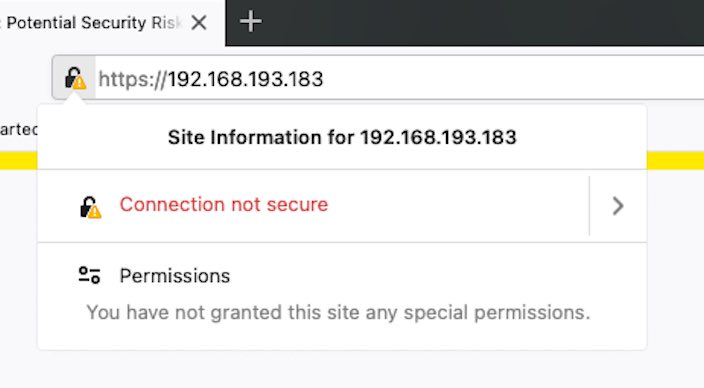

Click the details-arrow behind 'Information not secure'.  

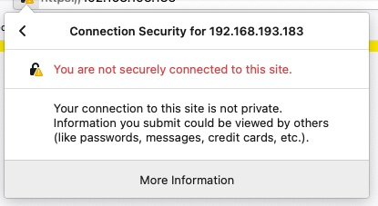

Click 'More information'.  

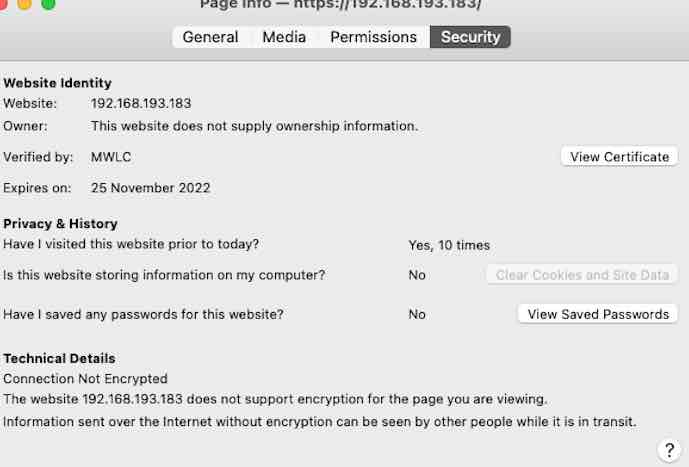  
  
    
Click 'View certificate' and scroll down.  

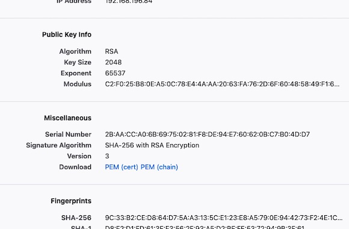  
  
   
Click 'PEM (cert)' to download the file and save it to your disk and remember the location.  

The certificate is now downloaded to your computer

###Install and trust the certificate

Go to the certificate and open it.  

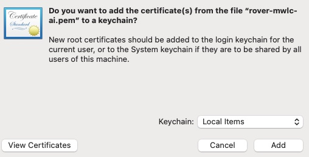  
  
The mac will ask to add the certificate to the computer for further usage.
Choose as keychain 'login' and click add.  
It's installed.

Go on with trusting it.  
Go to your key-chain and double-click the certificate. The certificate is called 'rover.mwlc.ai'.  

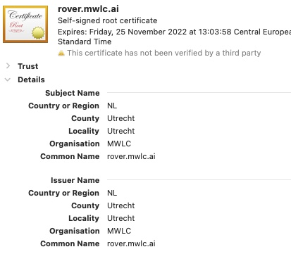  
  
  
Open the 'Trust'-section.

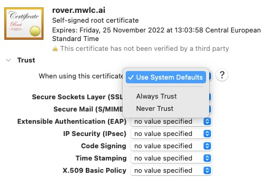  
  
Choose 'Always trust'.  
If requested, accept this with your password.  
  
  Go with Chrome to the robot and check is your controller works.

