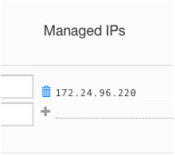

# Startup and maintenance

## Summary

The robot is accessible via a ZeroTier Virtual Private Network (VPN) which is setup to accommodate one or more robots managed by 
the VPN-manager.  
We setup a ZeroTier-VPN with the robot as a node. The VPN-manager has an mwlc.global account. Please refer to your credentials document.  
The robot can be driven by one operator at a time, not more.

### Preparation
Members of a ZeroTier network are referred to as ‘nodes’. Unless otherwise setup any authorised node can access any other 
authorised node in the same network.

#### ZeroTier client
Install [ZeroTier client](https://www.zerotier.com/download/) on your computer.  
Check your NodeID. This is the ID assigned to your computer. The NodeID will be used in any networks joined.  
Join the network with the ID in the credentials.

#### ZeroTier management
Go to [my.zerotier.com](https://my.zerotier.com).  
Login with the credentials you received from MWLC.  
Go to `Networks`.  
Authorise your computer on the network. You can identify your computer using its NodeID from the preparation step.   
When successful your computer will receive a managed ip.  
Notice the managed ip of the robot in the network. This is the ip to access the robot at.

### Chrome
On your computer, install the Google Chrome browser.  

### Start
Unpack the robot.
Turn the key and wait for several minutes for the startup procedure of the different devices to complete.   
Plug the controller into your computer.
Open chrome and browse to the managed ip of the robot as shown in my.zerotier.com *network* information. 
As an example assume the robot’s managed ip is 192.168.193.42. In the browser’s address bar type:  

    http://192.168.193.42

### Store
1. Place the robot on a platform so that the wheels can turn freely.
1. Plug the charging cable into the charging socket and an internet connection into the WAN-port.
1. For support, it is desirable to place the robot in front of a mirror.

---

## Introduction
You have or will receive a robot from MWLC. To get it operational, you have to make arrangements:

* Check the contents of the package   
* The emailed documentation
* Study the documentation
* Install software 
* Prepare the robot  

The robots from MWLC can be managed and/or operated via internet. A robot runs webservices that can be accessed via a browser.   
To ensure security, the robot is only accessible via a VPN.  
Familiarise yourself with the documentation from ZeroTier.

## Pack-list
Your package should include:

* 1 robot * 2 keys with the number mentioned in your credentials list
* 1 Victron charger with a Rosenberger connector
* 1 PS4 controller
* 1 USB cable
##### Lifting  
The robot should weight a little less than 25kg.  
It should be able to lift the robot on the longitudinal beam at the top. Always check if the bolts are tight enough.
### E-mailed information
In your email you should have:  

* A reference to this pages
* A credentials list

### Credentials
In your credentials you should have:  
  
* RobotID
* 1 ZeroTier login email/ID
* 1 ZeroTier password
* 1 ZeroTier network ID
* The identification number of the ignition keys  

Please check if the information is complete

## Preparation
### Once

#### In advance
Send your e-mail address to MWLC.  
You will receive this instruction from MWLC.  
Install the necessary software on your computer.
  
1. ZeroTier client application from: [www.zerotier.com/download](https://www.zerotier.com/download/)
1. Google Chrome

#### Received together with the Robot
Credentials

#### Connect your computer to VPN
Join your computer to the - MWLC provided - ZeroTier network ID with the option ‘Allow managed’.  
Notice the NodeID of your computer and check in the VPN members section in [my.zerotier.com](https://my.zerotier.com) 
whether the correct computer is authorised.

#### Login into network management
* Go to [my.zerotier.com/login](https://my.zerotier.com/login)
* Login with the email address from the credentials
* Authenticate with the password from the credentials
* Choose menu option `Networks`
* Go to the network with the networkID from the credentials
* Check the joined computers by nodeID.
* Authorise your computer as member.  

See also manual [‘Connections and ZeroTier’](zerotier_manual.md).

#### Per robot 

> Take note of the managed ip of the robot.

#### Information about usage
See manual [controller and browser](operator_manual.md).

### Per session

#### Guard
Don’t drive the robot unattended.

#### On and off
The robot is switched on and off with the ignition key.

#### Start Robot
* Take one of the ignition keys. Put it in the lock and turn it up.  
* A blue led will light up. This is the 12vdc circuit.  
* After a while some small leds on the router will light up, and after one or 
  two minutes more leds will light up. You will hear a soft rattling sound from the camera’s.
* Press `East` (see manual [controller and browser](operator_manual.md)), and the main engines will start with the sound of fans.
* Ask the guard to hit the stop button. The main motor should stop.

#### Prepare operator seat
Connect the controller to the computer via bluetooth or USB-cable.  
Start google chrome.

#### Start operation
Browse to the ip of the robot.  
See manual [‘Controller and Browser’](operator_manual.md) for further instructions.

#### Start training
See manual [‘Training Autopilot’](autopilot_manual.md) for further instructions.

## Maintenance

#### Store
When the robot is used the system will try to update software via the cloud. If functionality is changed, a release memo 
and updated manuals will be provided.  
To ensure the updates are possible:  
1. Place the robot on a platform so that the wheels can turn freely.  
1. Plug the charging cable into the charging socket.
1. Plug an internet connection into the WAN-port.

#### Charge
The robot can be charged with a Victron Blue smart 24v/5A charger. 
See [www.victronenergy.com/chargers/blue-smart-ip65-charger](https://www.victronenergy.com/chargers/blue-smart-ip65-charger). 
The charger comes with an app with all relevant information.  
At the back of the robot you will find a magnetic Rosenberger connector. The charge connector fits in one orientation only.

#### Clean
It's important to keep the transparent casing of the camera’s clean.  
For maintenance of the chassis please follow the guidelines of Arrma.

## Troubleshooting

The robot is built with broadly general available parts. You can assemble it yourself but some companies prefer an 
[assembled version](mwlc_order.md). 
For more information contact MWLC for a parts list and [assembly instructions](mwlc_kit.md).

#### Main engine does not start but all lights are on.
Please check the fuse for the chassis.

#### Main engine does not stop after hitting the red button.
This is dangerous, don't use the robot. Contact us.

### Connection issues
See manual [‘Connections and ZeroTier’](zerotier_manual.md).
